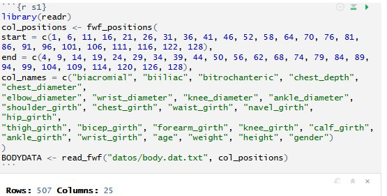
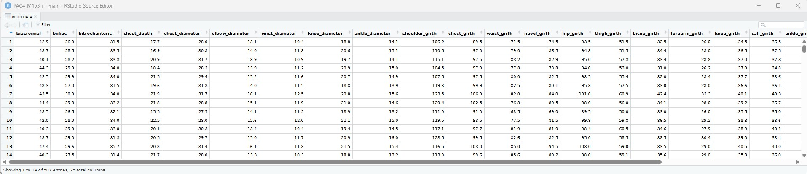
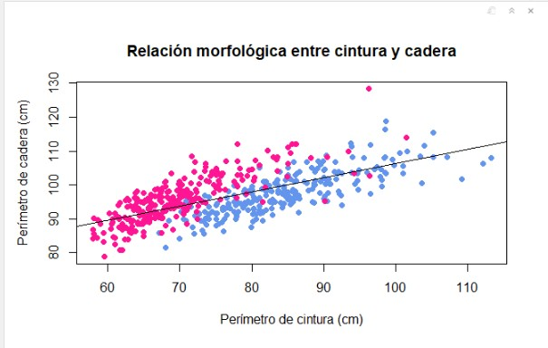
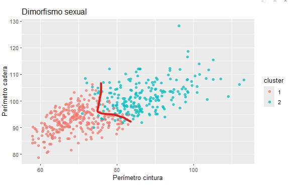
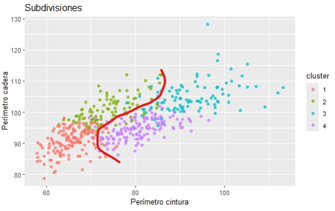

# Sección 1. Contexto y objetivo del estudio. Datos (1 punto)
**Debéis buscar un conjunto de datos relacionado con la Bioestadística y la Bioinformática, basándoos en los intereses profesionales o las preferencias del grupo.**
**Especificad la procedencia o el origen de los datos, incluid las referencias correspondientes y justificad por qué habéis elegido estos datos, indicando qué objetivos o preguntas queréis responder.**

Los datos proceden del estudio “Exploring Relationships in Body Dimensions” publicado en el Volúmen 11, número 2 del JSE (Journal of Statistics Education), también conocido cómo el JSDSE (Journal of Statistics and Data Science Education), en 2003 por Grete Heinz y Louis Peterson. Se estudian las proporciones del cuerpo humano a partir de numerosas medidas (abdomen, extremidades, peso, altura). 

Hemos escogido estos datos ya que la muestra es grande, con variables tanto numéricas como categóricas, con la posibilidad de procesar alguna variable para crear rangos y valorar otros enfoques y es un tema para el que podemos formular diversas hipótesis partiendo de diferentes perspectivas - género, edad, peso. No tiene valores nulos, lo que nos beneficia principalmente porque no perdemos datos, y además facilita el procesado de los datos para los apartados más complejos como los modelos de aprendizaje automático y la visualización con shiny.

El objetivo principal es comprobar diferencias biológicas que puedan ser explicadas según el principio de dimorfismo sexual, comparar las tendencias observadas con los patrones de acumulación de grasa asociados al sexo del individuo, qué medidas van más estrechamente relacionadas con el aumento o descenso del peso, encontrar medidas clave que permitan inducir otras a través de modelos de predicción,  y detectar tendencias según la edad.


# Sección 2. Prospección y preparación de los datos. (2 puntos)

## 2.1 Descripción de los datos (1 punto)

**Utilizando R, mostrad y explicad el tipo de fichero que habéis importado y las variables que lo componen. Esta descripción debe incluir (basándose en conceptos del LAB1):**

● Descripción general del conjunto de datos.
● Tipo y clasificación de las variables (numéricas, categóricas, etc.).
● Tamaño del conjunto de datos.
● Detección de valores nulos.
● Valoración del conjunto de datos (necesidad de transformaciones o presencia de inconsistencias).
Debéis incluir capturas de pantalla y las instrucciones en R utilizadas para importar y mostrar los datos.

El tipo de fichero importado es un fichero de text (.txt) de formato ancho fijo (fixed-width), lo que quiere decir que cada columna contiene un número fijo de posiciones de caracteres que hemos de traducir al importar el documento. Las posiciones que usaremos están indicadas en el apéndice del paper, y a través de la función fwf_positions() designaremos los puntos de inicio, final, y las etiquetas de las columnas (medidas) para asignar a éstas de manera respectiva. Después crearemos el conjunto de datos con la función read_fwf("pathway del archivo", "información de lectura que hemos creado").

Implementación de los datos para trabajar con ellos:

```{r s1}
library(readr)
col_positions <- fwf_positions(
start = c(1, 6, 11, 16, 21, 26, 31, 36, 41, 46, 52, 58, 64, 70, 76, 81, 86, 91, 96, 101, 106, 111, 116, 122, 128),
end = c(4, 9, 14, 19, 24, 29, 34, 39, 44, 50, 56, 62, 68, 74, 79, 84, 89, 94, 99, 104, 109, 114, 120, 126, 128),
col_names = c("biacromial", "biiliac", "bitrochanteric", "chest_depth", "chest_diameter",
"elbow_diameter", "wrist_diameter", "knee_diameter", "ankle_diameter",
"shoulder_girth", "chest_girth", "waist_girth", "navel_girth", "hip_girth",
"thigh_girth", "bicep_girth", "forearm_girth", "knee_girth", "calf_girth",
"ankle_girth", "wrist_girth", "age", "weight", "height", "gender")
)
BODYDATA <- read_fwf("datos/body.dat.txt", col_positions)
```


Como podemos ver este método ya nos da las dimensiones de los datos (507 rows, 25 columnas.)
Si comprobamos la estructura con str(BODYDATA), encontramos que al importar, todas son numéricas.

```{r s221}
str(BODYDATA) #Estructura de los datos
```

Este conjunto de datos contiene una serie de 25 medidas antropométricas (25 variables) en centímetros de un total de 507 individuos. Estas medidas son planas (entre crestas como las acromiales e ilíacas), de profundidad y diámetro (codo, muñeca, rodilla y tobillo) y de circunferencia (hombro, pecho, cintura, abdomen, muslo, biceps, pantorrilla), además de altura, peso, edad y género. 
Todas las variables aparecen como numéricas. Las medidas en centímetros, el peso y la altura son variables contínuas, la edad la consideraríamos variable numérica discreta y el género a pesar de estar etiquetado con sistema numérico, es categórico con dos niveles (0 - Mujer, 1 - Hombre).

Comprobamos si hay valores nulos asignando la función de contabilizarlos a una variable, y mostramos la variable. En caso de que hubiera, utilizaríamos la función na.omit(BODYDATA), pero no hay valores nulos así que no hace falta.

```{r s2212}
contNA <- sum(is.na(BODYDATA))
contNA
```

Como tal no hay necesidad previa al estudio de transformar los datos, solo de tener en cuenta que la variable género está representada numéricamente (0 = mujer, 1 = hombre).

## 2.2 Preguntas "objetivo" (1 punto)

**Plantead un mínimo de cuatro preguntas objetivo que den una idea de la información contenida en el conjunto de datos. El objetivo es obtener información a partir de determinados criterios, según variables o rangos de valores. Podéis vasaros en el tipo de consultas realizadas en la PEC1 y utilizar, en alguno de los casos, la definición de funciones (tal como se trabaja en el LAB3).**

- ¿Qué tan evidente es el dimorfismo sexual en los humanos, a nivel biológico?
- ¿Qué medidas corporales están más estrechamente relacionadas con el aumento de peso?
- ¿Se acumula la grasa con algún patrón específico según el sexo del individuo? Es decir, ¿varían igual las medidas corporales en aumentar el peso entre hombres y mujeres, o detectamos algún patrón?

- ¿Son las medidas más alejadas del *core* las menos adecuadas para realizar predicciones biológicas? - ¿Se desechan medidas de muñeca, codo, tobillo y rodilla en modelos de regresión múltiple?

# Sección 3. Análisis exploratorio de los datos (2,5 puntos)

## 3.1 Análisis descriptivo y gráfico (1 punto)

**Realizad un análisis descriptivo de los datos (basado en conceptos del LAB2). Este estudio debe incluir un resumen paramétrico de los datos y diversas representaciones gráficas basadas en critarios determinados según los tipos de variables y el objetivo del estudio. El tipo de gráficos y los criterios quedan a vuestra elección.**

*Resumen paramétrico global*
Podemos usar la función describe() del paquete psych para obtener 12 parámetros estadísticos de interés, entre ellos la media, la desviación estandar, mediana, cuartiles, valores máximos y mínimos que nos describen para cada variable y nos dan información sobre las magnitudes también tenemos skew y kurtosis con los que podemos estimar la normalidad de la distribución de los datos para cada una. Además podemos volver a comprobar que hay 25 variables y 507 observaciones de cada una, lo que corresponde a 0 valores nulos para este dataset (12.675 datos en total).

```{r s331}
library(psych)
describe(BODYDATA)
```

Aquí podemos observar como difieren medidas planas de sus correspondientes medidas de perímetro, como es el caso de los pares "biacromial"  - "shoulder_girth" y "bitrochanteric" - "hip_girth". 
La media de la distancia entre las crestas acromiales es de 38.81 centímetros (un valor muy cercano a la mediana/Q2) y con una desviación estándar de aproximadamente 3 centímetros mientras que el correspondiente perímetro de hombros mide el volumen de esta zona y tiene una media de 108.20 y una desviación de 10.37 centímetros.

Medidas de volumen (girth) del core son las desviaciones estandar más grandes de todo el dataset. Perímetro de pecho [93.33 +- 10.03], perímetro de cintura [76.98 +- 11.01] y perímetro de abdomen a la altura del ombligo [85.65 +- 11.01] junto con el peso [69.15 +- 13.35] son las que tienen desviaciones más altas. Conjuntamente, estas son las que presuponemos que son más impactadas por el patrón de acumulación de grasa y por ende, por el peso.

A simple vista puede parecer que el estadístico de media y desviación estandar para el género no tiene sentido pero que nos dé una media de 0.49+-0.50 es un indicador muy bueno de que el estudio es equitativo, es decir, la mitad o casi la mitad de la muestra es hombre (1), la otra mitad mujer (0).

El siguiente estudio descriptivo se hará sobre las variables "waist_girth", "hip_girth", "biacromial" y "weight".

#### HISTOGRAMA. Waist_girth.

Observaremos la distribución del perímetro de cintura a través de la muestra con un histograma.

```{r 3histograma}
hist(BODYDATA$waist_girth,
     main = "Distribución del perímetro de cintura",
     xlab = "perímetro(cm)",
     ylab = "Observaciones",
     col = "orange2")
abline(h = axTicks(2), col = "gray", lty = "dotted")
```

#### BOXPLOT. Hip_girth en función de género.

Observaremos la distribución del perímetro de cadera en función del género. Esperamos encontrar dimorfismo sexual. Podríamos usar biiliac, pero la acumulación de grasa en esta zona también es un patrón biológico, así que consideramos correcto asumir hip_girth en lugar de biiliac.

```{r 3boxplot}
boxplot(hip_girth~gender, data = BODYDATA,
        main = "Perímetro de cadera por género",
        xlab = "Género",
        ylab = "Perímetro (cm)",
        names = c("Mujer", "Hombre"),
        col = c("pink", "skyblue"))
```
Nos encontramos que al asumir a ciegas y sin tener en cuenta la talla de los individuos, que aún así los hombres presentan perímetros mayores de cadera. Como accesorio para el contexto, añadimos un scatterplot del peso en función de la altura, coloreado según el género.

```{r 3scatterplot}
#Si es 1 (HOMBRE) asocia azul, si no, rosa:
colores <- ifelse(BODYDATA$gender == "1", "cornflowerblue", "deeppink")
#Plot
plot(BODYDATA$weight, BODYDATA$height,
     xlab = "Peso (kg)",
     ylab = "Altura (cm)",
     main = "Relación peso - altura",
     pch = 19,
     col = colores)
legend("topleft",
       legend = c("Mujer", "Hombre"),
       col = c("deeppink", "cornflowerblue"),
       pch = 19,
       title = "Género",
       bty = "n")
```

Y con esto podríamos teorizar que esta diferencia se vea influenciada por la diferencia de tamaños entre los dos géneros. El camino correcto para comprobar esta hipótesis sería hacer un estudio de proporciones con respecto a la cadera y ver si las mujeres presentan una tendencia a mayores caderas que los hombres.

#### BOXPLOT 2: Distancia biacromial en función de género.
O en otras palabras, la distancia entre las dos crestas de los hombros, es la medida más médica para el marco óseo en lugar de shoulder_girth. Esperamos encontrar dimorfismo sexual, también.

```{r 3boxplot2}
boxplot(biacromial ~ gender, data = BODYDATA,
        main = "Distancia biacromial por género",
        xlab = "Género",
        ylab  = "Perímetro (cm)",
        names = c("Mujer", "Hombre"),
        col = c("pink", "skyblue"))
```

Comprobamos que existe una diferencia grande entre los marcos óseos de hombres y mujeres para la alta espalda, la media de los hombres estando por encima de los 40 centímetros, y la media de las mujeres por debajo; valores atípicos extendiéndose hasta por encima de los 40 donde se encuentran aún valores normales para hombres.

#### SCATTERPLOT. Waist_girth con hip_girth.

Esto podría mostrarnos asociación morfológica entre ambas y en cómo puede sesgar nuestra asociación de la hip_girth a un género en concreto si lo coloreamos por género.

```{r waisthip}
colores2 <- ifelse(BODYDATA$gender == 1, "cornflowerblue", "deeppink") 
plot(BODYDATA$waist_girth, BODYDATA$hip_girth,
     xlab = "Perímetro de cintura (cm)",
     ylab = "Perímetro de cadera (cm)",
     main = "Relación morfológica entre cintura y cadera",
     pch = 19,
     col = colores2)
abline(lm(hip_girth ~ waist_girth, data = BODYDATA), col = "black")
```

Vemos que en esta muestra hay una cierta agrupación de observaciones femeninas con altos perímetros de cadera a menores perímetros de cintura, situándose por encima de hombres con el mismo perímetro de cintura pero menores de cadera, lo que indicaría que a mismos perímetros de cintura -**70, 80 centímetros**- las mujeres presentan mayor perímetro de cadera que los hombres, lo que podría responder a la acumulación biológica de grasa en esas zonas, o a que parten de una base ósea mayor (distancia bitrocantérica).

## 3.2 EJERCICIOS DE INFERENCIA Y SIMULACIÓN (1.5 puntos)

**a) Basándoos en los conceptos trabajados en el LAB3, definid una función en R que realice algún tipo de cálculo de interés en el contexto del conjunto de datos.**

Un parámetro de interés es el IMC; aunque con ello surgen una serie de dudas que comentaremos más adelante. 

Para el contexto de estos datos, aunque no hay NA ni valores 0, agregamos la comprobación básica. Tras eso y teniendo en cuenta que la medida de la altura ya está en centímetros, describimos la función de la siguiente manera:

```{r 3IMC}
#Función ÍNDICE MASA CORPORAL

calcular_IMC <- function(peso, altura){
  #Comprobación básica
  if (any(is.na(peso)) || any(altura <= 0)){
    stop("Se encuentran valores NA en peso o altura.")
  }
  if (any(peso <=0) || any(altura <= 0)){
    stop("Peso y altura deben ser mayores que 0.")
  }
  #Conversión cm a metros
  altura_m <- altura/100
  
  #CÁLCULO
  IMC <- peso / (altura_m^2)
}
BODYDATA$IMC <- calcular_IMC(BODYDATA$weight, BODYDATA$height)
summary(BODYDATA$IMC)
```
**b) Basándoos en los conceptos del LAB4 y la PEC2, plantead un mínimo de tres enunciados que respondan a una cuestión de probabilidad.**

##### 1. ¿Cuál es la probabilidad de que un individuo del conjunto de datos tenga un IMC superior a la media?

Identificamos la media del IM de manera matemática por precisión, aunque tenemos por el summary del apartado anterior que ronda (23.46) y calculamos la proporción de datos por encima de esta media (IMC > media / total = media), correspondiendo al cálculo de la probabilidad empírica. Lo multiplicamos por 100 y redondeamos a dos decimales para obtener un porcentaje regular y obtenemos que:

```{r 3cuestion1}
media_IMC <- mean(BODYDATA$IMC)
p1 <- mean(BODYDATA$IMC > media_IMC)
round((p1*100), digits = 2)
```

La probabilidad de que un individuo observado presente un IMC superior a la media es del 44.58%.

##### 2. Para estudios de sobrepeso, ¿Cuál es la probabilidad de que un hombre presente un IMC superior a 25? ¿Y una mujer?

```{r 3cuestion2}
p2_hombres <- mean(BODYDATA$IMC[BODYDATA$gender == 1] > 25)

p2_mujeres <- mean(BODYDATA$IMC[BODYDATA$gender == 0] > 25)

cat(
  "Probabilidad de IMC superior a 25:\n",
  "Hombres:", round((p2_hombres*100), digits = 2), "%\n",
  "Mujeres:", round((p2_mujeres*100), digits = 2), "%\n"
)
```

En hombres es del 42.51%, en mujeres del 17.31%

Para añadir robustez, podemos calcular un intervalo de confianza. Partiendo de un modelo binomial y sabiendo que las observaciones son independientes y la probabilidad en un inicio no está condicionada, podemos hacerlo con la función prop.test() o test de Wilson.

```{r 3cuestion2wilson}
#HOMBRES
IMCH <- BODYDATA$IMC[BODYDATA$gender == 1] #Vector filtrado IMC hombres
NH <- length(IMCH)   #tamaño muestral
XH <- sum(IMCH > 25) #cuántos hombres con imc > 25

hombres95 <- prop.test(XH, NH, conf.level = 0.95)$conf.int #Devuelve el intervalo
#PROP. MUESTRAL
PMhombres <- XH/NH

#MUJERES
IMCM <- BODYDATA$IMC[BODYDATA$gender == 0] #Vector filtrado IMC mujeres
NM <- length(IMCM)   #tamaño muestral
XM <- sum(IMCM > 25) #cuántas mujeres con imc > 25

mujeres95 <- prop.test(XM, NM, conf.level = 0.95)$conf.int #Devuelve el intervalo
#PROP. MUESTRAL
PMmujeres <- XM/NM

#Respuesta
intervalos95 <- sprintf(
  paste(
    "Probabilidad de presentar un IMC superior a 25:",
    "\nHombres: %1.f%% (IC95%%: %.1f-%.1f%%)",
    "\nMujeres: %1.f%% (IC95%%: %.1f-%.1f%%)"
  ),
  PMhombres * 100, hombres95[1] * 100, hombres95[2] * 100,
  PMmujeres * 100, mujeres95[1] * 100, mujeres95[2] * 100
)

cat(intervalos95)
```
Como podemos ver con el estudio de la muestra, el 43% de los hombres y el 17% de las mujeres presentan un IMC superior a 25. 
Bajo el modelo binomial considerado, la probabilidad poblacional de presentar un IMC mayor a 25 se situaría entonces entre el 36.3 - 48.9% en hombres y 13.0 - 22.6% en mujeres con un 95% de confianza.

Aunque es importante apuntar que tener un IMC alto no equivale necesariamente a sobrepeso, dado que cuanto tratamos el peso del individuo no estamos distinguiendo entre masa muscular o grasa, por lo que no podemos discriminar entre personas con sobrepeso real o de elevada masa muscular; lo que sí podemos afirmar es que existe IMC más alto en hombres que en mujeres y que usamos el IMC como clasificación antropométrica y no diagnóstica.

Medidas como plicometrías o bioimpedancias (Básculas que miden el porcentaje de grasa corporal) contextualizarían este marco de estudio, o en su falta, hacer un estudio de correlación entre el IMC y la circunferencia de cintura, siendo este último un indicador de la grasa abdominal.

##### 3. ¿Cuál es la probabilidad de que un hombre mida más de 185 cm, asumiendo que la altura sigue aproximadamente una distribución normal?

Aproximamos a la normal a partir de la estadística descriptiva del apartado 3.1 donde obtenemos que la media es de 171.1 cm (recortada 170.93 cm) y la mediana 170.3, lo que indica una simetría alrededor de la media. La desviación estándar de 9.41 cm y la desviación absoluta mediana de 10.67 cm muestran una dispersión moderada con un rango que va desde los 147.2 a los 198.1 centímetros de altura. 
La distribución de los datos presenta una asimetría leve (skew de 0.15) y un aplanamiento de la curva respecto a la normal existente pero moderado (kurtosis -0.46), lo que respalda la simetría de la curva y sus colas.

```{r 3normal}
alturahombres <- BODYDATA$height[BODYDATA$gender == 1] #Filtramos hombres
muhombres <- mean(alturahombres)
sdhombres <- sd(alturahombres)

#Calculo probabilidad teorica -> P(X<185) y lo restamos a 1
pteorica <- 1 - pnorm(185, mean = muhombres, sd = sdhombres)
probteorica <- pteorica * 100

#Calculo probabilidad observada (media alturas > 185)
pobs <- mean(alturahombres > 185)
pobservada <- pobs * 100

resultadonormal <- sprintf(
  "La probabilidad teórica es de %1.f%%, y la probabilidad observada de %.1f%%",
  probteorica,
  pobservada
)
cat(resultadonormal)
```
Obtenemos bajo los supuestos de normalidad que la probabilidad teórica de que un hombre mida más de 1.85m es de 16%. En el estudio, se da una probabilidad empírica del 17%. Es una diferencia de 1 punto lo que nos indica coherencia y buena aproximación.

**c) Incluid un mínimo de un enunciado que corresponda a un breve modelo de simulación. Si vuestro conjunto de datos no facilita este tipo de enunciados, podéis generar una o varias distribuciones basándoos en parámetros determinados definidos por vosotros, afines al contexto del estudio.**

Podemos utilizar un modelo de regresión lineal múltiple para obtener coeficientes de relación entre las medidas que consideramos más significativas (girth de waist, chest y hip) y el peso, y luego utilizarlos en la simulación normal para el peso.
Para encontrar la variabilidad real (desviación estandar) para la simulación, extraemos los residuos del mismo modelo.

```{r 3coeficientes}
#Preparamos
set.seed(777)
n <- 2000

#Valores simulados para cada variable
waist <- rnorm(n, mean(BODYDATA$waist_girth), sd(BODYDATA$waist_girth))
chest <- rnorm(n, mean(BODYDATA$chest_girth), sd(BODYDATA$chest_girth))
hip <- rnorm(n, mean(BODYDATA$hip_girth), sd(BODYDATA$hip_girth))

#Regresión múltiple (REAL)
rlmult <- lm(weight ~ waist_girth + chest_girth + hip_girth, data = BODYDATA)

#Coeficientes
coef_mult <- coef(rlmult)

#Desviación estandar del modelo
residusmult <- residuals(rlmult)
sdmult <- sd(residusmult)

#Simulación (contribución de cada factor al weight)
weightSIM <- coef_mult["(Intercept)"] +
  coef_mult["waist_girth"]*waist +
  coef_mult["chest_girth"]*chest +
  coef_mult["hip_girth"]*hip +
  rnorm(n, 0, sdmult)

summary(weightSIM)
```

Vamos a hacer una comparativa visual entre los datos reales y la simulación.


```{r 3comparativaplot}
simulacionplot <- data.frame(
  weight = c(BODYDATA$weight, weightSIM),
  datos = rep(c("Muestra", "Simulación"), c(nrow(BODYDATA), length(weightSIM)))
)
boxplot(weight ~ datos, data = simulacionplot,
        main = "Comparación de peso: Muestra VS Simulación",
        ylab = "Peso (kg)",
        col = c("lavender", "darkseagreen"))
```

Esta diferencia que vemos en la dispersión viene principalmente justificada porque la simulación es más grande que la propia muestra, hemos forzado una distribución completamente normal de los datos y centrada en la media, haciendo que los datos simulados se presenten de forma más simetrica y concentrada que la real.

## Sección 4. Modelos de aprendizaje automático (2.5 puntos)

**Basándoos en los conceptos trabajados en el LAB5 y a partir de vuestro conjunto de datos y de los objetivos del estudio, evaluad qué tipo de modelos conviene realizar aprendizaje supervisado o no supervisado.**
● **Justificad vuestra elección.**
● **Mostrad el detalle del estudio realizado.**
● **Incluid las representaciones gráficas correspondientes (por ejemplo, clústeres, si procede).**


Con el tipo de datos que tenemos, creemos que conviene hacer un modelo de aprendizaje automático no supervisado: tenemos muchas variables a través de las cuales se pueden iniciar varias líneas de estudio y escoger una nos hace dejar atrás muchas otras opciones válidas.

Explorar agrupamientos con las variables que tenemos a mano nos hace considerar el conjunto entero de datos para encontrar la mejor combinación de parámetros para hacer predicciones sobre perfiles morfológicos.

Partiendo de aquí, podemos utilizar un algoritmo k-means para dividir la muestra en clusters según perfiles corporales, usando medidas representativas tanto del marco óseo como del patrón de acumulación de grasa (girth) para ello, y compararlo con algún gráfico descriptivo realizado en la Sección 3.1 para detectar algún patrón. También podríamos servirnos del aprendizaje supervisado para testar la pregunta número 4 propuesta al inicio de la PAC, usando una stepAIC para detectar qué medidas son las que aportan menos información al modelo.


##### k-means. Aprendizaje no supervisado.

Primero empezaremos con el k-means, y como paso previo al algoritmo haremos elbow-method a través del decrecimiento de la suma de cuadrados intra-cluster (WSS) para determinar una k adecuada, que es el punto en el que la pendiente de reducción del WSS cambia, creando un codo en la gráfica.

Usaremos waist_girth, chest_girth, hip_girth, shoulder_girth y thigh_girth por los motivos expresados anteriormente.


```{r aprendizajenosup}
library(ggplot2)

#Variables a usar
varcluster <- BODYDATA[, c("waist_girth","chest_girth","hip_girth","shoulder_girth","thigh_girth")]

#Normalizar los datos
varescaladas <- scale(varcluster)

#ELBOW METHOD. Partimos de 10 clusters.

WSS <- numeric(10)
for(k in 1:10){
  valork <- kmeans(varescaladas, centers = k, nstart = 25)
  WSS[k] <- valork$tot.withinss #suma total WSS
}

plot(1:10, WSS, type="b",
     xlab = "Número de clusters",
     ylab = "WSS",
     main = "Elbow method")
```

La bajada es muy pronunciada hasta el 2, y entre el 2 y el 4 aún vemos una pendiente clara. Esto podría indicarnos que existen dos divisiones evidentes correspondientes a dos agrupaciones de morfologías muy contrarias (cuerpos muy pequeños, y cuerpos muy grandes) y morfologías intermedias que se pueden agrupar dentro de uno o de otro pero que en añadir más divisiones, forman agrupaciones más claras. Haremos el método k-means para 2 y 4 para observar la estructura global (dimorfismo sexual) y una caracterización más detallada de los tipos morfológicos observados en el estudio.

A pesar de entrenar el modelo con varias variables, haremos el plot con waist_girth y hip_girth de manera paralela al estudio descriptivo del inicio del trabajo, para poder compararlo.

```{r 3kmeans1}
# K-means k=2
set.seed(123)
km <- kmeans(vars_scaled, centers = 2, nstart = 25)

#Etiquetamos dataset
BODYDATA$cluster <- factor(km$cluster)
#Plot
ggplot(BODYDATA, aes(x=waist_girth, y=hip_girth, color=cluster)) +
  geom_point(alpha=0.7) +
  labs(title="Dimorfismo sexual",
       x="Perímetro cintura", y="Perímetro cadera")
```

Ahora para 4.

```{r 3kmeans2}
# K-means k=2
set.seed(123)
km <- kmeans(vars_scaled, centers = 4, nstart = 25)

#Etiquetamos dataset
BODYDATA$cluster <- factor(km$cluster)
#Plot
ggplot(BODYDATA, aes(x=waist_girth, y=hip_girth, color=cluster)) +
  geom_point(alpha=0.7) +
  labs(title="Subdivisiones",
       x="Perímetro cintura", y="Perímetro cadera")
```

Como podemos ver, en el primer clustering encontramos una división que agrupa parte de datos femeninos en el cluster 2 (de mayoría masculina si tenemos en cuenta el gráfico descriptivo de relación morfológica entre cintura y cadera, figura 3.) y parte de los datos masculinos en el cluster 1 (de mayoría femenina). Esto es porque fenotipos de menor tamaño se asocian en el cluster 1 por tendencia y los demás en el 2. 

En añadir la subdivisión (k = 4) podemos ver que se forman 4 grupos que corresponden mucho mejor con la distribución de la figura 3, teniendo en cuenta que cluster 1 y 2 serían de fenotipo femenino, y el cluster 3 y 4 de fenotipo masculino. Los valores atípicos para cada fenotipo se agrupan automáticamente dentro del clúster más cercano y no al que pertenecen realmente ya que el modelo de predicción no tiene tanta precisión como para detectarlos.

Se adjuntan figuras 4 y 5 con marcas para señalar las subdivisiones.







##### stepAIC. Aprendizaje supervisado.

Esta parte es simplemente para poder descartar o no medidas más alejadas del core con respaldo estadístico. Este método forma parte del aprendizaje supervisado.

```{r stepAIC1}
variablesaic <- c(
  "biacromial","biiliac","bitrochanteric",
  "chest_depth","chest_diameter",
  "elbow_diameter","wrist_diameter","knee_diameter","ankle_diameter",
  "shoulder_girth","chest_girth","waist_girth","navel_girth","hip_girth",
  "thigh_girth","bicep_girth","forearm_girth","knee_girth","calf_girth",
  "ankle_girth","wrist_girth"
)

modelfull <- lm(weight ~ ., data = BODYDATA[, c(variablesaic, "weight")])

modelAIC <- step(modelfull, direction = "both", trace = FALSE)
summary(modelAIC)
setdiff(variablesaic, names(coef(modelAIC))[-1])
```
Por el estadístico F y el p-valor muy inferior al valor crítico podemos determinar que el conjunto de predictores seleccionado es altamente significativo, a pesar de tener un error estandar del 2.69 (aprox.) este es razonable para medidas antropométricas.

Las variables que no mejoran el modelo y se descartaron, muchas son medidas periféricas alejadas del core (ankle, wrist, knee), aunque hay algunas como chest_diameter y bicep_girth que son medidas centrales pero pueden tener mucha variabilidad que no necesariamente se explica por patrones biológicos ni aportan más información a la hora de hacer predicciones. Otra medida, bitrochanteric, que sí se consideró al inicio del estudio como importante fue descartada por no mejorar el modelo.

**Gracias a esto podríamos responder a la pregunta 4 que medidas más periféricas aportan menos información a un modelo de predicción y por lo tanto son descartadas.**


